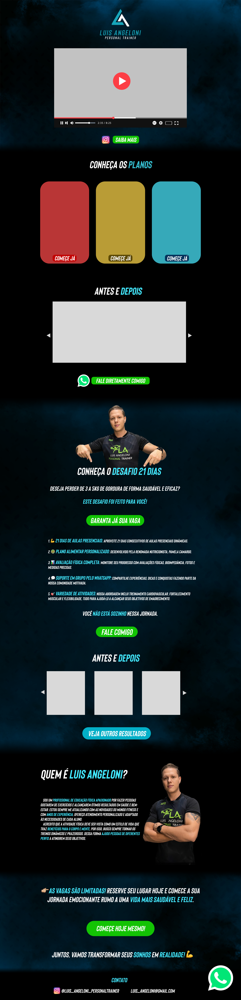

# Landing page - Personal Luis Angeloni
**Design UX** de uma lading page para o personal trainer **Luis Angeloni**.

  

 

## 🧱 Construção do design
A construção do design da landing page se iniciou com a análise de requisitos, foi desenvolvido um breve questionário com o intuito de identificar os principais pontos que o cliente gostaria que a página tivesse e principalmente o que **NÃO** precisaria ter. Posteriormente foi feito o envio de imagens e artes que o cliente gostaria que fosse utilizado no site.
Dito isso, foi desenvolvido *3 versões*, sendo: 
- A primeira com um foco maior em divulgar o programa *Desafio 21 dias* que o cliente estaria vendendo,
- As outras duas versões com um foco na imagem do próprio personal.
 

  
  
  

 

## 🛠 Ferramentas utilizadas

 

## 📙 Conclusão
Foi decidido junto ao cliente, a mescla entre apresentação do personal e o foco na venda no programa *Desafio 21 dias*. Sendo assim, o layout foi pensado de maneira que o usuário começe vendo uma apresentação geral em vídeo, seguido de quais planos são ofertados pelo personal, avaliações de clientes (ANTES/DEPOIS), o *Desafio 21 dias* e por fim de quem se trata o personal, sua trajetória e especialidades.
 

>[!WARNING]
> A parte de desenvolvimento do código não foi realizado, o objetivo deste trabalho era realizar o design da landing page, pensando na distribuição de elementos na página de forma que fique **amigável**, **legível** e **chamativo**.

